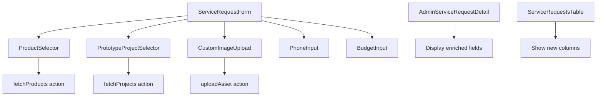

# Plan d'Implémentation : Demande de Service Enrichie

## Vue d'ensemble

Ce document détaille le plan complet pour implémenter les fonctionnalités enrichies des demandes de service, permettant aux clients de :
- Sélectionner des articles du catalogue existant
- Choisir un prototype de projet passé comme référence
- Spécifier leur budget
- Fournir un numéro de téléphone
- Téléverser une image personnalisée d'article souhaité

## État Actuel

### ✅ Complété (Base de données)
- Table `service_request_products` créée avec RLS
- Colonnes ajoutées à `service_requests`:
  - `phone` (text)
  - `client_budget` (numeric(12,2))
  - `custom_item_image_url` (text)
  - `custom_item_image_asset_id` (uuid → assets)
  - `prototype_project_id` (uuid → projects)

### ✅ Partiellement Complété (Application)
- Action serveur [`submitServiceRequest()`](src/app/actions/service-request-actions.ts:43) accepte les nouveaux champs
- Insertion dans `service_request_products` implémentée (lignes 168-188)
- Formulaire de base avec champs `phone` et `client_budget` (lignes 259-286)
- Champs `prototype_project_id` et `product_ids` présents mais non fonctionnels

## Architecture des Composants



## Tâches d'Implémentation

### 1. Types TypeScript (src/types/index.ts)

**Objectif**: Ajouter les nouveaux champs au type `ServiceRequest`

**Modifications**:
```typescript
export interface ServiceRequest {
  // ... champs existants ...
  
  // Nouveaux champs enrichis
  phone?: string | null;
  client_budget?: number | null;
  custom_item_image_url?: string | null;
  custom_item_image_asset_id?: string | null;
  prototype_project_id?: string | null;
}

export interface ServiceRequestProduct {
  id: string;
  service_request_id: string;
  product_id: string;
  created_at: string;
  product?: {
    name: string;
    description?: string;
    image_url?: string;
    base_cost?: number;
  };
}
```

**Fichier**: [`src/types/index.ts`](src/types/index.ts:99)

---

### 2. Composant ProductSelector

**Objectif**: Permettre la sélection multiple d'articles du catalogue

**Spécifications**:
- Multi-select avec recherche/filtrage
- Affichage en grille avec images
- Compteur de sélection
- Support du clavier (accessibilité)

**Nouveau fichier**: `src/components/forms/product-selector.tsx`

**Structure**:
```typescript
interface ProductSelectorProps {
  selectedIds: string[];
  onSelectionChange: (ids: string[]) => void;
  userId?: string; // Pour filtrer les produits de l'utilisateur
}

export function ProductSelector({ selectedIds, onSelectionChange, userId }: ProductSelectorProps) {
  // État local pour recherche et filtrage
  // Fetch des produits disponibles
  // UI avec grille de cartes produits
  // Gestion de la sélection multiple
}
```

**Dépendances**:
- [`Checkbox`](src/components/ui/checkbox.tsx) pour sélection
- [`Input`](src/components/ui/input.tsx) pour recherche
- [`Card`](src/components/ui/card.tsx) pour affichage produits
- [`Badge`](src/components/ui/badge.tsx) pour compteur

---

### 3. Composant PrototypeProjectSelector

**Objectif**: Sélectionner un projet existant comme prototype/référence

**Spécifications**:
- Dropdown avec aperçu des projets
- Affichage du nom, description et image principale
- Filtrage par statut (completed/active)
- Option "Aucun prototype"

**Nouveau fichier**: `src/components/forms/prototype-project-selector.tsx`

**Structure**:
```typescript
interface PrototypeProjectSelectorProps {
  selectedProjectId?: string;
  onProjectSelect: (projectId: string | undefined) => void;
}

export function PrototypeProjectSelector({ selectedProjectId, onProjectSelect }: PrototypeProjectSelectorProps) {
  // Fetch des projets disponibles
  // Combobox avec recherche
  // Aperçu du projet sélectionné
}
```

**Dépendances**:
- [`Select`](src/components/ui/select.tsx) ou [`Popover`](src/components/ui/popover.tsx) + [`Command`]
- [`Avatar`](src/components/ui/avatar.tsx) pour images projet

---

### 4. Composant CustomImageUpload

**Objectif**: Téléverser une image d'article personnalisé souhaité

**Spécifications**:
- Upload d'image unique
- Prévisualisation
- Validation (format, taille)
- Intégration avec système `assets`
- Suppression possible

**Nouveau fichier**: `src/components/forms/custom-image-upload.tsx`

**Structure**:
```typescript
interface CustomImageUploadProps {
  assetId?: string | null;
  onAssetChange: (assetId: string | null) => void;
}

export function CustomImageUpload({ assetId, onAssetChange }: CustomImageUploadProps) {
  // Gestion du drag & drop
  // Upload vers assets
  // Prévisualisation
  // Bouton de suppression
}
```

**Référence**: Inspiré de [`ProductImageUpload`](src/components/product-image-upload.tsx) et [`SpaceImageUpload`](src/components/space-image-upload.tsx)

---

### 5. Actions Serveur

#### 5.1 fetchProductsForSelection

**Objectif**: Récupérer les produits disponibles pour sélection

**Nouveau fichier**: `src/app/actions/product-actions.ts`

```typescript
export async function fetchProductsForSelection(userId?: string) {
  // Récupérer les produits publics ou de l'utilisateur
  // Retourner id, name, description, image_url, base_cost
  // Gérer les permissions RLS
}
```

#### 5.2 fetchProjectsForPrototype

**Objectif**: Récupérer les projets disponibles comme prototypes

**Nouveau fichier**: `src/app/actions/project-actions.ts`

```typescript
export async function fetchProjectsForPrototype(userId?: string) {
  // Récupérer les projets completed/active
  // Retourner id, name, description, image principale
  // Filtrer selon permissions
}
```

#### 5.3 uploadCustomItemImage

**Objectif**: Gérer l'upload d'image personnalisée

**Fichier existant**: Utiliser ou étendre les actions d'upload existantes

---

### 6. Mise à Jour du Formulaire

**Fichier**: [`src/components/forms/service-request-form.tsx`](src/components/forms/service-request-form.tsx:1)

**Modifications**:

1. **Imports des nouveaux composants** (ligne ~8):
```typescript
import { ProductSelector } from './product-selector';
import { PrototypeProjectSelector } from './prototype-project-selector';
import { CustomImageUpload } from './custom-image-upload';
```

2. **Mise à jour du schéma Zod** (ligne 22):
```typescript
const formSchema = z.object({
  // ... champs existants ...
  phone: z.string().trim().optional().nullable(),
  client_budget: z.string().optional().nullable(),
  prototype_project_id: z.string().uuid().optional().nullable(),
  product_ids: z.array(z.string().uuid()).optional().default([]),
  custom_item_image_asset_id: z.string().uuid().optional().nullable(),
});
```

3. **Remplacer les champs placeholder** (lignes 295-328):
   - Remplacer le champ `prototype_project_id` par `<PrototypeProjectSelector />`
   - Remplacer le champ `product_ids` par `<ProductSelector />`
   - Ajouter `<CustomImageUpload />` après le budget

4. **Améliorer le champ téléphone** (ligne 262):
   - Utiliser [`PhoneInput`](src/components/ui/phone-input.tsx) au lieu de `Input` basique

---

### 7. Internationalisation (i18n)

**Fichiers à mettre à jour**:
- [`src/i18n/messages/fr/app-common.json`](src/i18n/messages/fr/app-common.json)
- `src/i18n/messages/en/app-common.json`
- `src/i18n/messages/es/app-common.json`

**Nouvelles clés**:
```json
{
  "serviceRequest": {
    "phone": "Téléphone",
    "phonePlaceholder": "+33 6 12 34 56 78",
    "clientBudget": "Budget client",
    "clientBudgetPlaceholder": "50000",
    "prototypeProject": "Projet de référence",
    "prototypeProjectPlaceholder": "Sélectionnez un projet similaire",
    "prototypeProjectNone": "Aucun prototype",
    "catalogProducts": "Articles du catalogue",
    "catalogProductsDescription": "Sélectionnez les articles qui vous intéressent",
    "customImage": "Image personnalisée",
    "customImageDescription": "Téléversez une image de l'article souhaité",
    "selectedProducts": "{count} article(s) sélectionné(s)",
    "searchProducts": "Rechercher des articles..."
  }
}
```

---

### 8. Interface Admin

#### 8.1 Détail de Demande

**Fichier**: [`src/components/admin/service-request-detail-dialog.tsx`](src/components/admin/service-request-detail-dialog.tsx)

**Modifications**:
- Ajouter section "Informations Enrichies"
- Afficher téléphone, budget client
- Afficher prototype sélectionné avec lien
- Afficher liste des produits sélectionnés avec images
- Afficher image personnalisée si présente

**Structure proposée**:
```tsx
<div className="space-y-4">
  <h3>Informations Enrichies</h3>
  
  {request.phone && (
    <div>
      <Label>Téléphone</Label>
      <p>{request.phone}</p>
    </div>
  )}
  
  {request.client_budget && (
    <div>
      <Label>Budget Client</Label>
      <p>{formatCurrency(request.client_budget)}</p>
    </div>
  )}
  
  {request.prototype_project_id && (
    <div>
      <Label>Projet de Référence</Label>
      <Link to={`/projects/${request.prototype_project_id}`}>
        Voir le projet
      </Link>
    </div>
  )}
  
  {products.length > 0 && (
    <div>
      <Label>Articles Sélectionnés ({products.length})</Label>
      <div className="grid grid-cols-3 gap-2">
        {products.map(p => <ProductCard key={p.id} product={p} />)}
      </div>
    </div>
  )}
  
  {request.custom_item_image_url && (
    <div>
      <Label>Image Personnalisée</Label>
      <ImageLightbox src={request.custom_item_image_url} />
    </div>
  )}
</div>
```

#### 8.2 Table des Demandes

**Fichier**: [`src/components/admin/service-requests-table.tsx`](src/components/admin/service-requests-table.tsx)

**Modifications**:
- Ajouter colonnes optionnelles: "Téléphone", "Budget", "Prototype"
- Ajouter badge pour nombre de produits sélectionnés
- Ajouter icône si image personnalisée présente

---

### 9. Tests

#### 9.1 Tests Unitaires

**Nouveau fichier**: `src/lib/service-request.test.ts`

**Scénarios**:
```typescript
describe('submitServiceRequest', () => {
  it('should create request with all enriched fields', async () => {
    // Test avec tous les champs remplis
  });
  
  it('should link selected products correctly', async () => {
    // Test de la relation service_request_products
  });
  
  it('should handle optional fields gracefully', async () => {
    // Test avec champs optionnels vides
  });
  
  it('should validate budget format', async () => {
    // Test de validation du budget
  });
  
  it('should validate phone format', async () => {
    // Test de validation du téléphone
  });
});
```

#### 9.2 Tests d'Intégration

**Scénarios manuels**:
1. Soumettre une demande avec tous les champs remplis
2. Vérifier l'enregistrement dans `service_requests`
3. Vérifier les liens dans `service_request_products`
4. Vérifier l'affichage dans l'interface admin
5. Tester la conversion en projet avec données enrichies

---

### 10. Validation et Gestion d'Erreurs

**Améliorations à apporter**:

1. **Validation côté client** (formulaire):
   - Format téléphone international
   - Budget > 0
   - Limite de produits sélectionnés (ex: max 20)
   - Taille d'image < 5MB

2. **Validation côté serveur** ([`service-request-actions.ts`](src/app/actions/service-request-actions.ts:11)):
   - Vérifier que les product_ids existent
   - Vérifier que le prototype_project_id existe
   - Vérifier que l'asset_id existe et appartient à l'utilisateur

3. **Messages d'erreur clairs**:
   - "Le projet de référence sélectionné n'existe plus"
   - "Certains articles sélectionnés ne sont plus disponibles"
   - "L'image téléversée est trop volumineuse"

---

## Ordre d'Implémentation Recommandé

1. ✅ **Types TypeScript** - Base pour tout le reste
2. **Actions serveur** - Données nécessaires aux composants
3. **Composant ProductSelector** - Fonctionnalité principale
4. **Composant PrototypeProjectSelector** - Fonctionnalité secondaire
5. **Composant CustomImageUpload** - Fonctionnalité optionnelle
6. **Mise à jour du formulaire** - Intégration des composants
7. **i18n** - Traductions
8. **Interface admin** - Visualisation
9. **Tests** - Validation
10. **Documentation** - Finalisation

---

## Considérations Techniques

### Performance
- **Lazy loading** des images produits dans ProductSelector
- **Pagination** si > 50 produits disponibles
- **Debounce** sur la recherche de produits (300ms)
- **Optimistic updates** pour meilleure UX

### Accessibilité
- Support complet du clavier pour tous les sélecteurs
- ARIA labels appropriés
- Focus management dans les modales
- Annonces screen reader pour sélections

### Sécurité
- Validation RLS pour tous les fetches
- Sanitization des uploads d'images
- Rate limiting sur les soumissions
- CSRF protection (déjà en place via Next.js)

### UX
- Indicateurs de chargement clairs
- Messages de succès/erreur visibles
- Prévisualisation avant soumission
- Sauvegarde brouillon (future amélioration)

---

## Dépendances Externes

Aucune nouvelle dépendance npm requise. Utilisation des composants UI existants:
- [`shadcn/ui`](src/components/ui/) components
- [`react-hook-form`](src/components/forms/service-request-form.tsx:4)
- [`zod`](src/app/actions/service-request-actions.ts:3)
- [`framer-motion`](src/components/forms/service-request-form.tsx:7) (déjà utilisé)

---

## Métriques de Succès

- ✅ Tous les champs enrichis sont sauvegardés correctement
- ✅ Les produits sélectionnés sont liés via `service_request_products`
- ✅ L'interface admin affiche toutes les informations enrichies
- ✅ Les tests unitaires passent à 100%
- ✅ Aucune régression sur les fonctionnalités existantes
- ✅ Temps de soumission < 3 secondes
- ✅ Taux d'erreur < 1%

---

## Documentation Utilisateur

À créer dans `docs/user-guide-service-requests.md`:
- Guide pour les clients: comment remplir une demande enrichie
- Guide pour les admins: comment interpréter les données enrichies
- FAQ sur les nouveaux champs
- Captures d'écran des nouvelles interfaces

---

## Notes de Migration

**Données existantes**:
- Les demandes existantes n'ont pas les nouveaux champs → valeurs NULL
- Aucune migration de données nécessaire
- Rétrocompatibilité assurée

**Rollback**:
- Les colonnes peuvent être supprimées sans impact sur les données existantes
- La table `service_request_products` peut être droppée si nécessaire

---

## Prochaines Étapes

Après validation de ce plan:
1. Créer une branche `feature/enriched-service-requests`
2. Implémenter les tâches dans l'ordre recommandé
3. Code review après chaque composant majeur
4. Tests manuels en environnement de staging
5. Déploiement progressif en production

---

**Dernière mise à jour**: 2026-06-14  
**Auteur**: Bob (Plan Mode)  
**Statut**: ✅ Prêt pour implémentation